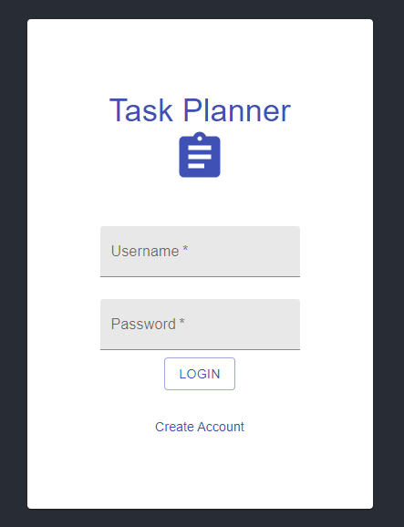
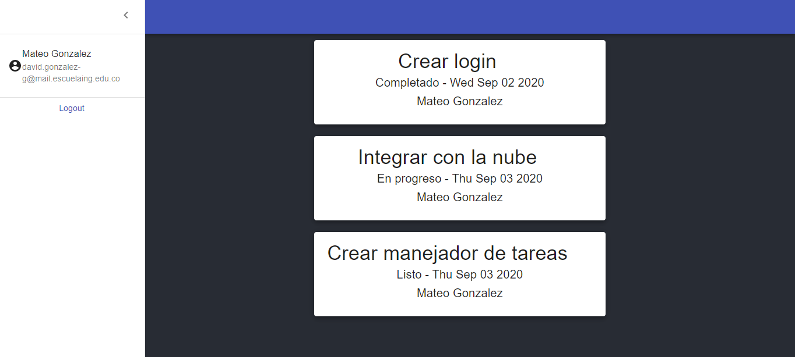

### Escuela Colombiana de Ingeniería
### Innovación y emprendimiento con TI

### Laboratorio 02 - Task Planer

### Codigo de honor:
Debes seguir el Código de honor del ingeniero de sistemas para defender el estándar de integridad académica de la ECI:

* Tus respuestas a tareas, cuestionarios y exámenes deben ser tu propio trabajo (excepto para las tareas que permiten explícitamente la colaboración).

* No puedes compartir tus soluciones de tareas, cuestionarios o exámenes con otra persona a menos que el instructor lo permita explícitamente. Esto incluye cualquier cosa escrita por ti, como también cualquier solución oficial proporcionada por el docente o el monitor del curso.

* No puedes participar en otras actividades que mejorarán de manera deshonesta tus resultados o que mejorarán de manera deshonesta o dañarán los resultados de otras personas.

**Como compilarlo**

`npm install`

`npm start`

## Part 1: 

Despues de clonar el repositorio, instalarle las dependencias necesarias y crear el codigo correspondiente a las clases login.js y login.css seremos capaces de visualizar.

`Usuario almacenado= Mateo`

`Contraseña= IETI1234`

## Part 2: Task Planer

Ya logueado con nuestro perfil y una vez creada toda la dinamica de las tareas mediados por los cards Layouts seremos obtendremos lo siguiente

## Part 3: Despleigue en heroku

   
### Authors

* **Mateo González**  - [mateu20](https://github.com/mateu20)
